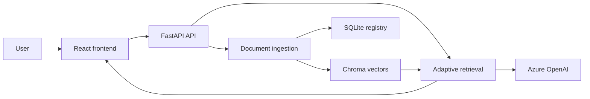

# Grounded — adaptive document question answering

Grounded lets users upload documents and ask questions with source references.
It combines a React/TypeScript interface, a FastAPI API, LangChain query
transformations, Chroma vector search, SQLite document metadata, and Azure
OpenAI chat and embeddings. A separate LangGraph pipeline explores evidence
planning, targeted retrieval retries, and refusal when supporting evidence is
missing; evaluation scripts compare it with the pipeline used by the API.

## Architecture



Uploads (PDF, DOCX, TXT, or Markdown, up to 10 MB) are parsed and split into
chunks; embeddings are persisted in Chroma and document metadata in SQLite.
For each question, the API selects or accepts a retrieval strategy, transforms
the query, fuses ranked search results, and generates an answer with source
metadata. The frontend shows the selected strategy, retrieval queries, and
sources; it also supports listing and deleting documents.

The API serves answers through `AdaptiveRAG` in [grounded/api.py](grounded/api.py),
which uses LangChain query transformations and reciprocal rank fusion.
[LangGraphRAG](grounded/langgraph_rag.py) is a separate pipeline built to test a
different approach: grading retrieved evidence and retrying targeted queries
rather than transforming the query up front. It runs standalone and is evaluated
against the API pipeline rather than serving traffic. The evaluation below
compares them.

Upload chunking uses **600 tokens with 100-token overlap**, configured in
[grounded/ingestion.py](grounded/ingestion.py) and explicitly matched in
[evaluation/evaluate_retrieval.py](evaluation/evaluate_retrieval.py). The shared
splitter uses tiktoken. Standalone web examples default to 300/50; parent chunks
for summary/proposition examples use 2000/200 in
[grounded/shared.py](grounded/shared.py).

## Adaptive retrieval

[AdaptiveRAG](grounded/adaptive_rag.py) builds these strategies with **LangChain**.
`auto` uses a structured LLM routing decision; callers can also choose a strategy.
The original question remains among the retrieval queries, and reciprocal rank
fusion combines results into at most eight chunks for answer generation.

| Strategy | Retrieval behavior |
|---|---|
| `simple` | Search directly with the original question. |
| `multi_query` | Ask the model for four alternative search phrasings. |
| `decomposition` | Ask for three searchable subquestions in the API pipeline. |
| `step_back` | Add a broader background question. |
| `hyde` | Generate a hypothetical answer passage to use only as a search query. |

The self-correcting workflow uses **LangGraph**. Its initial nodes are
`plan_retrieval → route_question → build_queries → retrieve → grade_evidence_task`.
The planner creates source-aware evidence tasks, validates document IDs, and
applies document metadata filters when a source is selected. In `auto`, a
multi-task or multi-source plan selects decomposition; those planned tasks
replace the separate decomposition transformer.

Conditional edges implement two checks:

- `grade_evidence_task`: if every task is supported, proceed to `grade_context`.
  Otherwise, `rewrite_task_queries` uses the grader's explanation to retry only
  insufficient tasks while preserving satisfied evidence and source filters.
  Each task permits an initial attempt and two retries. Exhausted tasks go
  through `fail_evidence_tasks → refuse_answer`.
- `grade_context`: sufficient combined evidence goes to `generate_answer`.
  Insufficient evidence goes through `rewrite_query → retrieve` while the global
  retry counter is below two, then to `refuse_answer`. Both answer and refusal
  terminate the graph. Task attempts and the global retry counter are separate.

The graph records task status, retry events, and model-call counts. Grading is
model-based and can reject an answerable question, as the saved comparison below
shows. The API's LangChain pipeline does not perform this grading/retry loop.

## Evaluation

The [evaluation directory](evaluation/) contains two PDF fixtures, the active
`apple_website_analysis_questions.jsonl` dataset, an empty `dataset.jsonl`
placeholder, retrieval scoring, RAGAS runners, and two committed JSON reports.
`evaluate_retrieval.py` measures evidence Precision@8, Recall@8, and source recall.
`compare_rag.py` prints a side-by-side pipeline run. `scoring.py` implements a
separate heuristic refusal score; `ragas_compat.py` handles an optional Vertex AI
import for RAGAS without adding that provider's dependencies.

RAGAS computes **Context Precision, Context Recall, Faithfulness, Answer
Relevancy, and Factual Correctness** (F1, high atomicity and coverage) for
answerable questions. Intentionally unanswerable records instead receive the
custom refusal-correctness score; their RAGAS scores are null.

### Baseline pipeline

The `simple` strategy over 16 answerable questions and 4 intentionally
unanswerable ones:

| Metric | Score |
|---|---:|
| Context precision | 0.966 |
| Context recall | 0.958 |
| Faithfulness | 0.957 |
| Answer relevancy | 0.671 |
| Factual correctness | 0.632 |
| Custom refusal correctness | 0.750 |

Source: [baseline report](evaluation/report/ragas_results.json).

### LangChain vs. LangGraph

A single cross-document question, run through both pipelines with `auto`
routing. **One question is not a benchmark** — it is a trace of how the two
pipelines behave on a question requiring evidence from more than one source.

| Metric | LangChain (API) | LangGraph |
|---|---:|---:|
| Context precision | 0.167 | 0.710 |
| Context recall | 0.500 | 0.500 |
| Faithfulness | 0.889 | 0.000 |
| Answer relevancy | 0.884 | 0.000 |
| Factual correctness | 0.000 | 0.240 |

The graph retrieved better context (0.710 vs 0.167 precision) but produced no
answer: it satisfied one of two planned evidence tasks, retried the second
twice, and refused. Faithfulness and answer relevancy are 0.000 because RAGAS
has no generated answer to grade — a refusal and a wrong answer score
identically under these metrics, which is a limitation of evaluating a pipeline
that can decline. The LangChain pipeline answered and scored well on
faithfulness, but 0.000 on factual correctness, so it answered fluently from
insufficient context.

Neither result settles which design is better. The graph's conservatism is the
intended behavior of evidence grading; whether refusing beats answering wrongly
depends on the application. Evaluating that tradeoff properly needs a larger
dataset with a metric that credits appropriate refusal — the custom refusal
score in [scoring.py](evaluation/scoring.py) is a first attempt.

Source: [comparison report](evaluation/report/ragas_comparison_results.json).

Run from the repository root after configuring Azure credentials:

```bash
python -m pip install -e ".[dev,eval]"
python -m evaluation.evaluate_retrieval
python -m evaluation.evaluate_ragas
python -m evaluation.evaluate_ragas_comparison --strategy auto
```

Evaluation calls Azure services and overwrites its corresponding report. For a
small run, set `RAGAS_EVALUATION_LIMIT` for the baseline or pass `--limit 1` /
`--question-id ecosystem-cloud-cross-document` to the comparison runner.
`RAGAS_EVALUATOR_MODEL` overrides the judge deployment.

## Tech stack

- Python 3.11–3.13, FastAPI, Pydantic, Uvicorn
- LangChain, LangGraph, Azure OpenAI
- Chroma, SQLite, tiktoken, PDF/DOCX/text loaders
- React, TypeScript, Vite, pnpm
- pytest, Ruff, RAGAS

## API reference

| Method | Path | Purpose |
|---|---|---|
| `GET` | `/health` | Check API readiness |
| `GET` | `/documents` | List indexed documents |
| `POST` | `/documents` | Upload and index a document |
| `DELETE` | `/documents/{document_id}` | Delete a document and its chunks |
| `POST` | `/rag/ask` | Ask a grounded question |

Interactive schemas: [FastAPI docs](http://127.0.0.1:8000/docs).
Upload a document before asking a question; an empty workspace returns HTTP 409.

## Setup

Install Git, Python 3.11–3.13, Node.js (the existing setup targets Node 24), and
pnpm 11. Provide an Azure OpenAI resource with chat and embedding deployments.
This is a public repository:

```bash
git clone https://github.com/DinhHuyGia/RagProject.git
cd RagProject
```

### macOS / Linux

```bash
python3 -m venv .venv
source .venv/bin/activate
python -m pip install -e ".[dev]"
cp .env.example .env
# Edit .env with your Azure credentials and deployment names.
python -m uvicorn grounded.api:app --reload
```

In a second terminal, from the repository root:

```bash
npm install --global pnpm@latest-11
cd frontend
pnpm install --frozen-lockfile
pnpm dev
```

### Windows / PowerShell

```powershell
py -3.12 -m venv .venv
.\.venv\Scripts\python.exe -m pip install -e ".[dev]"
Copy-Item .env.example .env
# Edit .env with your Azure credentials and deployment names.
.\.venv\Scripts\python.exe -m uvicorn grounded.api:app --reload
```

In a second PowerShell window, from the repository root:

```powershell
npm.cmd install --global pnpm@latest-11
cd frontend
pnpm.cmd install --frozen-lockfile
pnpm.cmd dev
```

Using the explicit interpreter avoids activation-policy issues. For other Python
commands in this README, substitute `.\.venv\Scripts\python.exe` for `python`.

### Configuration and checks

The backend loads the repository-root `.env` through `python-dotenv`; existing
process/user environment variables take precedence. Alternatively, export the
variables in your shell or set Windows User variables and reopen the terminal.
Every application environment setting is documented in [.env.example](.env.example).
The required values are `AZURE_OPENAI_API_KEY` (or the `AZURE_OPENAI_KEY` alias)
and `AZURE_OPENAI_ENDPOINT`. Use the resource endpoint without `/openai/v1/`;
the backend appends it. Deployment settings must be Azure deployment names.
If using the legacy key alias, remove the primary key placeholder from `.env`.

Open [Grounded](http://localhost:5173), upload a document, and select **Ask Grounded**.
Vite proxies `/api` to `http://127.0.0.1:8000`; for a separately hosted API, set
`VITE_API_BASE_URL` in `frontend/.env` and configure allowed backend origins.
Never put backend credentials in frontend environment variables. `.env` files
are ignored by Git.

```bash
python -m pytest
python -m ruff check .
cd frontend
pnpm typecheck
pnpm build
```

Tests use model doubles and deterministic embeddings without Azure credentials.
The first tokenizer use may download tiktoken vocabulary data; cached runs can
operate offline. Standalone retrieval examples remain available through
`python main.py --help` or the installed `grounded` command.

```text
RagProject/
├── grounded/       API, ingestion, retrieval pipelines, and standalone examples
├── frontend/       React application
├── evaluation/     Fixtures, questions, runners, and saved results
├── tests/          API, ingestion, graph, and scoring tests
├── docs/images/    UI screenshot location
├── data/           Ignored uploads, Chroma index, and SQLite registry
├── .env.example    Configuration template
├── main.py         Standalone example launcher
└── pyproject.toml  Package, dependencies, and tools
```

Runtime files live in `data/uploads/`, `data/chroma/`, and
`data/documents.sqlite3`. This is a shared local workspace without authentication;
do not expose development servers directly to the public internet.

## Troubleshooting

<details>
<summary>Environment, Azure, and local server troubleshooting</summary>

- **PowerShell blocks npm/pnpm scripts:** use `npm.cmd` and `pnpm.cmd`.
- **pnpm is missing:** install pnpm 11 and reopen the terminal.
- **Python activation is blocked:** use `.\.venv\Scripts\python.exe` directly.
- **Missing Azure endpoint:** edit the root `.env`, or set the environment
  variable and restart the backend. Existing environment values override `.env`.
- **Azure 401:** check that the key belongs to the configured resource and has
  no extra spaces. Do not print the key when diagnosing.
- **Azure deployment/404 error:** check deployment names and the resource
  endpoint; omit `/openai/v1/` from the configured endpoint.
- **Frontend cannot reach the API:** confirm backend startup and open
  [health](http://127.0.0.1:8000/health). Start Vite from `frontend/`.
- **Port 8000 is occupied:** stop the conflicting server or update both the
  backend port and the target in `frontend/vite.config.ts`.
- **Browser did not open:** open the URL Vite prints, normally
  [localhost:5173](http://localhost:5173).
- **Tokenizer download fails:** allow the initial vocabulary download before
  running ingestion tests offline.

</details>

More detail: [backend examples](grounded/README.md),
[frontend](frontend/README.md)
