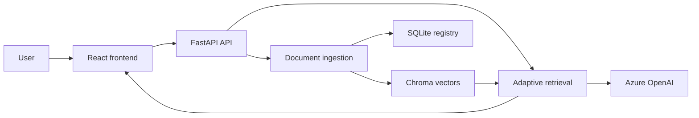

# Grounded: Adaptive RAG workspace

Grounded is a local document question-answering application. Users upload
documents, ask questions in natural language, and receive answers grounded in
the uploaded material with source references.

The project combines:

- A Python and FastAPI document API
- Chroma vector search
- LangChain retrieval strategies
- Azure OpenAI chat and embedding deployments
- A React and TypeScript frontend

## How it works



During local development, the frontend runs at `http://localhost:5173` and
forwards `/api` requests to FastAPI at `http://127.0.0.1:8000`.

## Features

- Upload PDF, DOCX, TXT, and Markdown documents
- Store document metadata in SQLite
- Persist embeddings in Chroma
- List and delete indexed documents
- Ask questions using automatic or manually selected retrieval strategies
- Display the selected strategy, generated retrieval queries, and sources
- Run the API and ingestion tests without Azure credentials

Uploads are limited to 10 MB per file.

## Repository layout

```text
RagCodeAlong/
├── frontend/             React and TypeScript application
├── rag_tutorial/         FastAPI, ingestion, retrieval, and tutorial modules
├── tests/                Offline API and ingestion tests
├── data/                 Local runtime data; excluded from Git
├── pyproject.toml        Python package and tool configuration
└── rag_codealong.py      Tutorial command-line launcher
```

## Prerequisites

Install the following before setup:

- Git
- Python 3.11, 3.12, or 3.13; Python 3.12 is recommended
- Node.js 24 LTS
- An Azure OpenAI resource with:
  - A chat model deployment
  - A `text-embedding-3-small` deployment, or another compatible embedding
    deployment

Confirm that the tools are available:

```powershell
git --version
py -3.12 --version
node --version
npm.cmd --version
```

Using the `.cmd` form of Node commands avoids PowerShell execution-policy
errors on Windows.

## Complete Windows setup

### 1. Get the project

Clone the private repository:

```powershell
git clone https://github.com/OWNER/RagCodeAlong.git
cd RagCodeAlong
```

Replace `OWNER` with the repository owner's GitHub username. If the project was
provided as a ZIP file, extract it and open PowerShell in the extracted
`RagCodeAlong` directory instead.

### 2. Create the Python environment

From the repository root:

```powershell
py -3.12 -m venv .venv
.\.venv\Scripts\python.exe -m pip install --upgrade pip
.\.venv\Scripts\python.exe -m pip install -e ".[dev]"
```

These commands use the virtual environment directly, so activating
`Activate.ps1` is not required.

### 3. Run the offline checks

Verify the project before adding Azure credentials:

```powershell
.\.venv\Scripts\python.exe -m pytest
.\.venv\Scripts\python.exe -m ruff check .
```

The tests use local test doubles and deterministic embeddings. They do not call
Azure OpenAI and do not require an API key.

Third-party deprecation warnings may appear during the test run. A successful
run ends with all collected tests reported as passed.

### 4. Configure Azure OpenAI

The backend requires these Windows user environment variables:

| Variable | Required | Example or default |
|---|---:|---|
| `AZURE_OPENAI_API_KEY` | Yes | Your Azure OpenAI key |
| `AZURE_OPENAI_ENDPOINT` | Yes | `https://resource-name.openai.azure.com/` |
| `AZURE_OPENAI_CHAT_DEPLOYMENT` | No | Defaults to `gpt-5-mini` |
| `AZURE_OPENAI_EMBEDDING_DEPLOYMENT` | No | Defaults to `text-embedding-3-small` |

The deployment variables must contain Azure **deployment names**. A deployment
name may differ from the underlying model name.

To create persistent variables on Windows:

1. Open the Start menu.
2. Search for **Edit environment variables for your account**.
3. Under **User variables**, select **New**.
4. Add `AZURE_OPENAI_API_KEY` with your authorized key.
5. Add `AZURE_OPENAI_ENDPOINT` with your Azure resource endpoint.
6. Add the two deployment variables if your Azure deployment names differ from
   the defaults above.
7. Close and reopen PowerShell and any editor or development application.

Enter the endpoint without `/openai/v1/`; the backend adds that path
automatically.

Confirm the required variables without printing the API key:

```powershell
if ($env:AZURE_OPENAI_API_KEY) {
    "Azure API key is available"
} else {
    "Azure API key is missing"
}

$env:AZURE_OPENAI_ENDPOINT
```

Never place the API key in Python code, frontend code, Git, GitHub, or
`frontend/.env`. Each reviewer should use credentials they are authorized to
use.

### 5. Install the frontend packages

Install pnpm 11 and the frontend dependencies:

```powershell
npm.cmd install --global pnpm@latest-11
pnpm.cmd --version
cd frontend
pnpm.cmd install
cd ..
```

The committed `pnpm-lock.yaml` keeps dependency versions reproducible.

### 6. Start FastAPI

In the first PowerShell window, from the repository root:

```powershell
.\.venv\Scripts\python.exe -m uvicorn rag_tutorial.api:app --reload
```

Wait until the terminal reports that the application startup is complete.
Useful backend addresses:

- API documentation: <http://127.0.0.1:8000/docs>
- Health check: <http://127.0.0.1:8000/health>

Keep this PowerShell window open.

### 7. Start the frontend

Open a second PowerShell window:

```powershell
cd C:\path\to\RagCodeAlong\frontend
pnpm.cmd dev
```

Replace `C:\path\to\RagCodeAlong` with the actual project location. Open the
local address printed by Vite, normally:

<http://localhost:5173>

Keep both PowerShell windows open while using the application. Press
`Ctrl+C` in each window to stop the servers.

## First-use walkthrough

1. Open the frontend.
2. Select **Add a document** and upload a PDF, DOCX, TXT, or Markdown file.
3. Wait until the document appears in the knowledge base.
4. Enter a question that can be answered by the document.
5. Leave retrieval set to **Auto** for the first test.
6. Select **Ask Grounded**.
7. Review the answer, strategy, sources, and retrieval details.
8. Use **Remove** to test document deletion if desired.

The API returns a conflict response if a question is submitted before at least
one document has been uploaded.

## Development commands

Run backend tests:

```powershell
.\.venv\Scripts\python.exe -m pytest
```

Run Python lint checks:

```powershell
.\.venv\Scripts\python.exe -m ruff check .
```

Build the frontend:

```powershell
cd frontend
pnpm.cmd build
```

Check TypeScript without creating a production build:

```powershell
cd frontend
pnpm.cmd typecheck
```

Preview the frontend production build:

```powershell
cd frontend
pnpm.cmd preview
```

## API summary

| Method | Path | Purpose |
|---|---|---|
| `GET` | `/health` | Check API readiness |
| `GET` | `/documents` | List indexed documents |
| `POST` | `/documents` | Upload and index a document |
| `DELETE` | `/documents/{document_id}` | Delete a document and its chunks |
| `POST` | `/rag/ask` | Ask a grounded question |

Interactive request and response documentation is available at
<http://127.0.0.1:8000/docs> while FastAPI is running.

## Local data and security

Runtime data is stored under `data/`:

```text
data/
├── uploads/              Uploaded source files
├── chroma/               Persisted vector index
└── documents.sqlite3     Document registry
```

The runtime data, Python environment, frontend dependencies, builds, and local
environment files are excluded through `.gitignore`.

This project currently provides a shared local workspace and does not include
authentication. Do not expose the development servers directly to the public
internet.

## Troubleshooting

### `npm.ps1` or `pnpm.ps1` cannot be loaded

PowerShell script execution is restricted. Use the command wrappers:

```powershell
npm.cmd --version
pnpm.cmd --version
```

The setup commands in this README already use those wrappers.

### `pnpm` is not recognized

Install it and reopen PowerShell:

```powershell
npm.cmd install --global pnpm@latest-11
pnpm.cmd --version
```

### Python activation is blocked

Activation is optional. Run the virtual environment's interpreter directly:

```powershell
.\.venv\Scripts\python.exe --version
```

### `AZURE_OPENAI_ENDPOINT environment variable is required`

Add `AZURE_OPENAI_ENDPOINT` as a Windows user variable, close PowerShell, and
open a new PowerShell window. The value should resemble:

```text
https://resource-name.openai.azure.com/
```

### Azure returns `401 Unauthorized`

Confirm that the API key belongs to the configured Azure OpenAI resource and
that it was copied without extra spaces. Do not print or share the key while
troubleshooting.

### Azure returns a deployment or `404` error

Confirm that the chat and embedding environment variables match the deployment
names shown in the Azure portal. Also confirm that the endpoint belongs to the
same Azure resource.

### The frontend says it cannot reach the document API

Confirm that:

1. FastAPI is still running at `http://127.0.0.1:8000`.
2. The FastAPI terminal shows a successful startup.
3. The frontend was started from the `frontend` directory.
4. The health check opens successfully.

### Port 8000 is already in use

Stop the other program using port 8000 before starting FastAPI. The frontend's
development proxy expects the backend at port 8000.

### The browser does not open automatically

Open the address printed by Vite manually, normally
<http://localhost:5173>.

## Additional documentation

- [Backend and tutorial details](rag_tutorial/README.md)
- [Frontend details](frontend/README.md)
